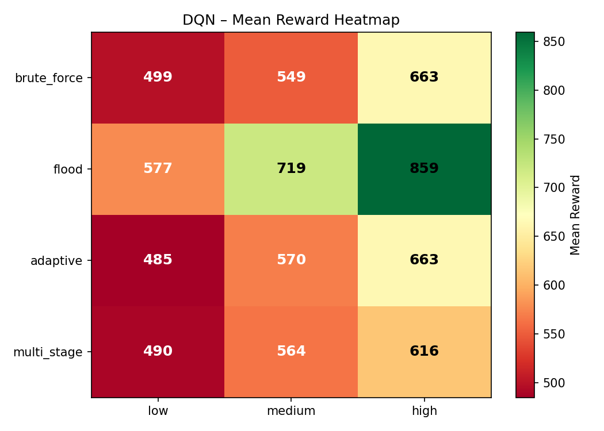
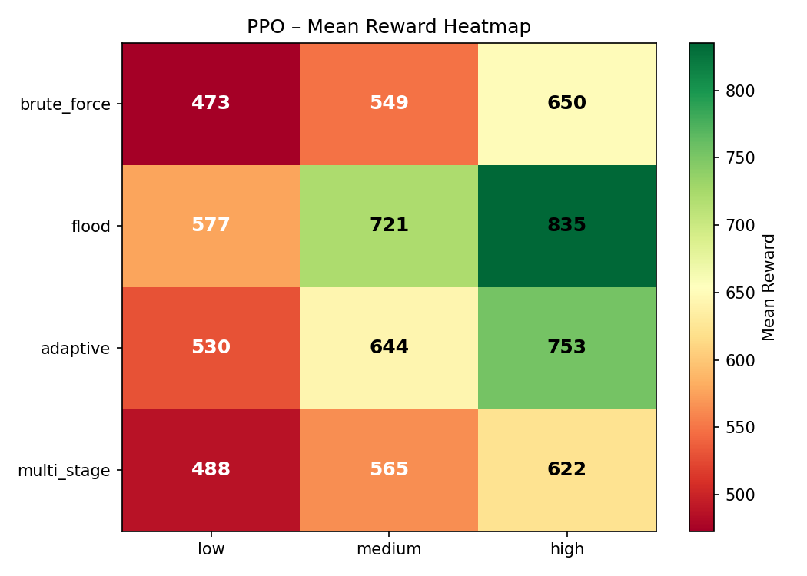
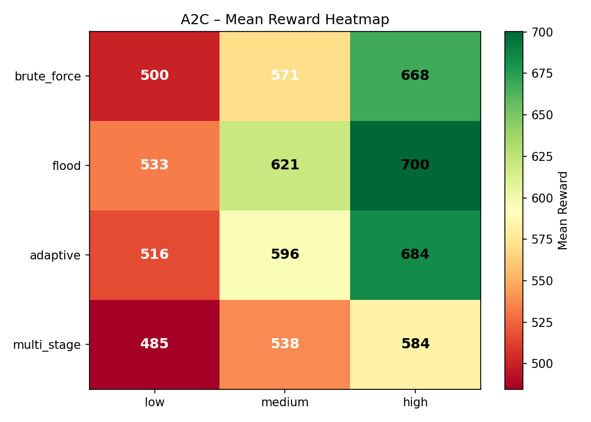
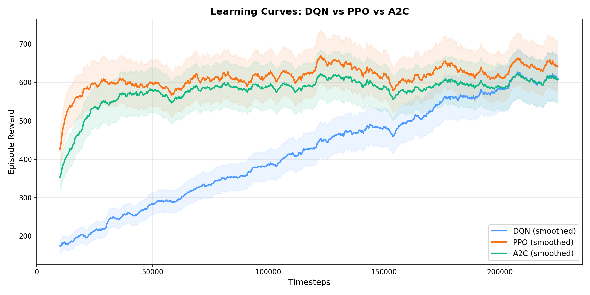
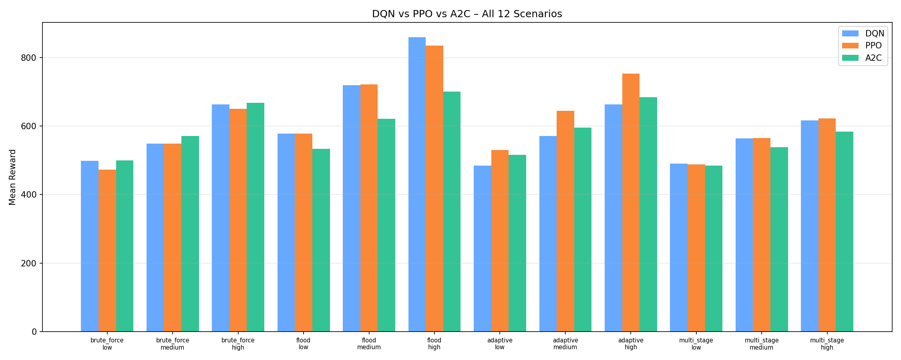

# AIRS – Autonomous Intrusion Response System

A **reinforcement learning–based cybersecurity defense system** that learns to respond to network intrusions in real time using **DQN**, **PPO**, and **A2C** algorithms.

> Agents are trained across all 12 attack scenarios (4 modes × 3 intensities) and achieve **0% false positive rate** while outperforming baselines by 3–4×.

## Demo


*Pygame visualizer showing the DQN agent defending against a high-intensity adaptive attack in real time.*

## Results

### Algorithm Comparison (500k timesteps, 12 scenarios)

| Algorithm | Avg Reward | Best Scenario | Worst Scenario | FPR |
|-----------|-----------|---------------|----------------|-----|
| **PPO** | **617.3** | flood/high (835) | brute_force/low (473) | 0% |
| **DQN** | **604.6** | flood/high (859) | brute_force/low (485) | 0% |
| **A2C** | **583.0** | flood/high (700) | brute_force/low (485) | 0% |
| rule_based | 392.1 | — | — | 0% |
| random | 168.1 | — | — | 0% |
| always_noop | -849.8 | — | — | 0% |

### Performance by Intensity

| Intensity | DQN | PPO | A2C |
|-----------|-----|-----|-----|
| Low | 512.6 | 517.0 | 508.5 |
| Medium | 600.8 | 619.7 | 581.5 |
| High | 700.5 | 715.3 | 658.9 |

### Performance by Attack Mode

| Mode | DQN | PPO | A2C |
|------|-----|-----|-----|
| brute_force | 570.4 | 557.4 | 579.5 |
| flood | 718.7 | 711.2 | 618.1 |
| adaptive | 572.7 | 642.5 | 598.7 |
| multi_stage | 556.7 | 558.1 | 535.5 |

### Heatmaps

<p float="left">
  
  
  
</p>

### Learning Curves



### Algorithm Comparison Chart



## Project Structure

```
├── airs/                             # Core package
│   ├── agent/
│   │   └── rl_agent.py              # DQN/PPO/A2C agent wrapper (SB3)
│   ├── environment/
│   │   ├── network_env.py           # Gymnasium MDP environment
│   │   ├── multi_scenario_env.py    # Multi-scenario wrapper (12 combos)
│   │   └── attack_simulator.py      # Attack traffic generator
│   ├── monitoring/
│   │   └── monitor.py               # Threat level computation
│   ├── response/
│   │   └── response_engine.py       # Defensive action outcomes
│   └── evaluation/                   # Metrics and evaluation framework
├── scripts/
│   ├── train_universal.py           # Train all algorithms (standard/curriculum)
│   ├── evaluate_all.py              # Full evaluation + charts
│   ├── watch_agent.py               # Pygame live visualizer
│   └── dashboard.py                 # Streamlit interactive dashboard
├── src/visualization/
│   └── renderer.py                  # Pygame renderer (sparklines, HUD)
├── configs/
│   └── default.yaml                 # All hyperparameters
├── models/                          # Saved model weights (.zip)
├── results/                         # Charts, CSV, learning curves
├── obsidian/                        # Research documentation
└── tests/                           # Test suite
```

## MDP Formulation

| Component | Definition |
|-----------|-----------|
| **State** | `[traffic_rate, failed_logins, cpu_usage, memory_usage, threat_level, last_action]` (normalized [0,1]) |
| **Actions** | `{observe, block_ip, rate_limit, isolate_service}` |
| **Reward** | `threat_reduction - service_cost - false_positive - unnecessary_action - breach_penalty + survival_bonus` |
| **Transitions** | Stochastic (attacker behavior + system dynamics) |

## Quick Start

```bash
# Install dependencies
pip install -r requirements.txt

# Train all 3 algorithms (500k steps)
python scripts/train_universal.py --timesteps 500000

# Train with curriculum (low → medium → high → mixed)
python scripts/train_universal.py --timesteps 500000 --curriculum

# Train single algorithm
python scripts/train_universal.py --algorithm dqn --timesteps 500000

# Evaluate across all 12 scenarios + baselines
python scripts/evaluate_all.py

# Launch interactive dashboard
streamlit run scripts/dashboard.py

# Watch agent defend in real time (pygame)
python scripts/watch_agent.py --algorithm dqn --attack_mode adaptive --intensity high
```

## Features

- **3 RL Algorithms**: DQN, PPO, A2C (via Stable-Baselines3)
- **4 Attack modes**: brute force, flood, adaptive, multi-stage
- **3 Intensity levels**: low, medium, high (12 total scenarios)
- **Multi-scenario training**: Agents generalize across all combinations
- **Curriculum training**: Progressive difficulty (low → medium → high → mixed)
- **Unnecessary action penalty**: Agents learn selective defensive behavior
- **Learning curves**: Reward vs timesteps for convergence analysis
- **3 Baselines**: always-noop, random, rule-based threshold
- **Streamlit dashboard**: 6 tabs, dark theme, interactive charts
- **Pygame visualizer**: Real-time network defense visualization
- **Full evaluation**: Heatmaps, bar charts, algorithm comparison, CSV export

## Key Findings

1. **PPO performs best overall** (617.3 avg) with most consistent performance across scenarios
2. **DQN excels on flood attacks** (718.7) due to clear threat signals
3. **A2C converges fastest** but plateaus lower (583.0 avg)
4. **All agents achieve 0% FPR** — no legitimate traffic is incorrectly blocked
5. **Higher intensity = easier** for agents (clearer threat signal → better decisions)
6. **multi_stage is hardest** for all algorithms (phased attacks are harder to detect)

## Configuration

All hyperparameters in `configs/default.yaml`:

```yaml
agent:
  algorithm: dqn  # dqn | ppo | a2c
training:
  total_timesteps: 500000
  curriculum:
    enabled: true
```

## License

Research project – all rights reserved.
